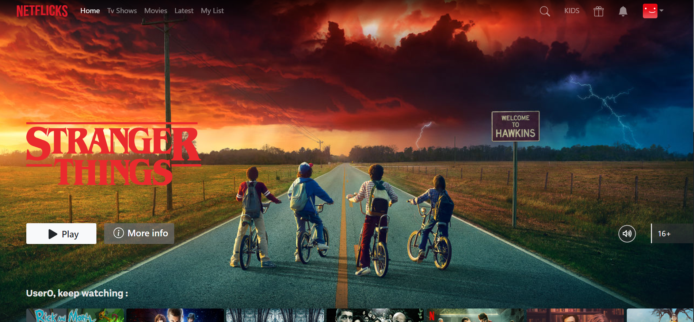
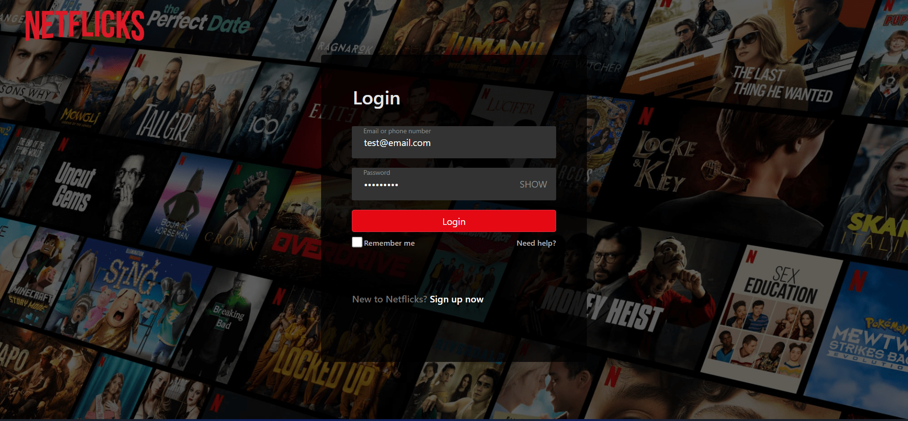
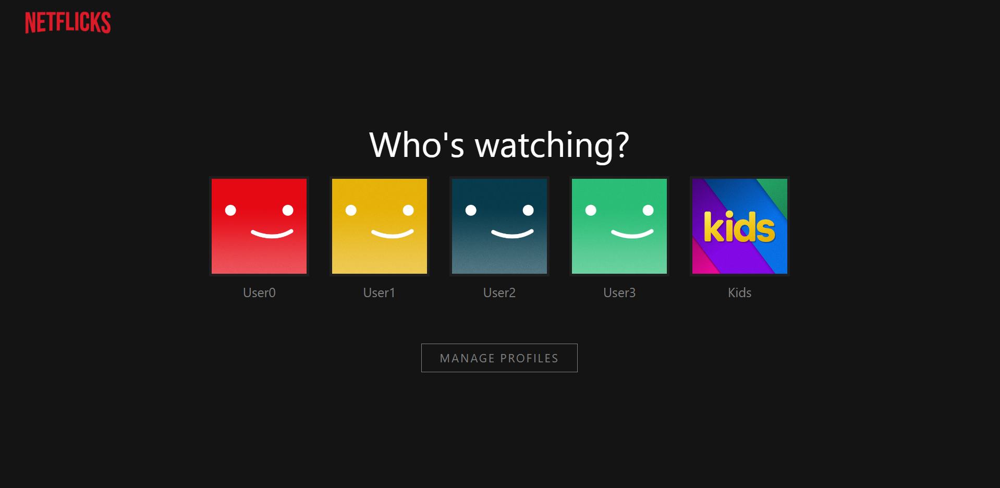
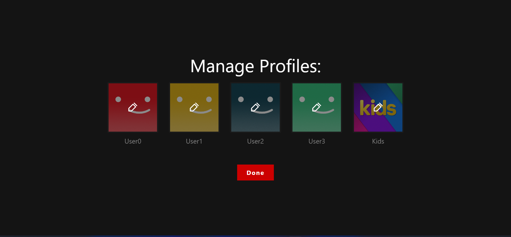
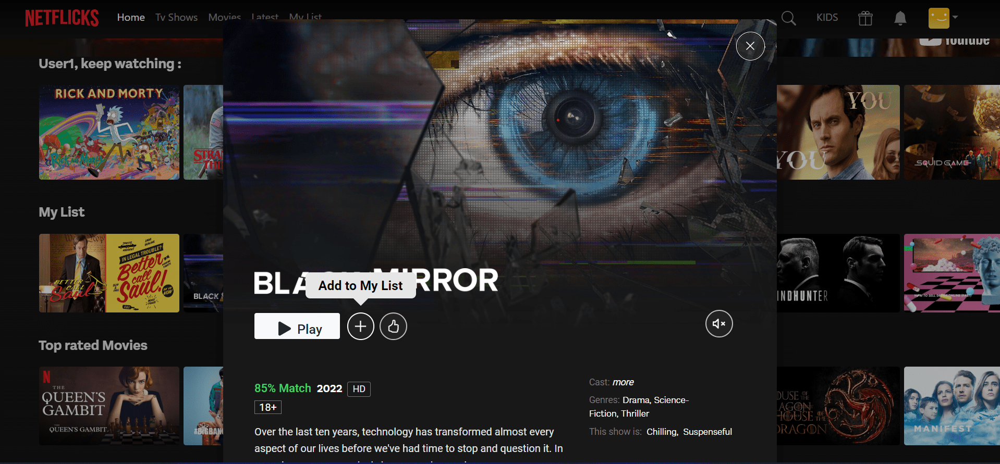
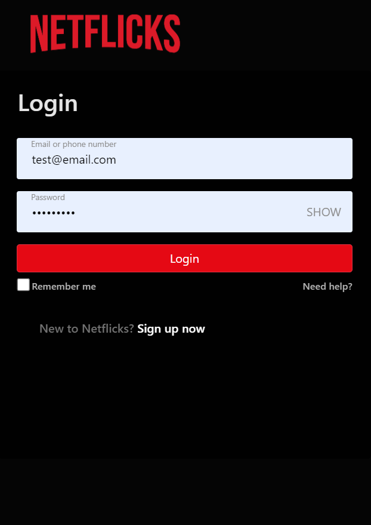

# Angular 15, RxJS and Bootstrap
A case study of Netflix Clone, using Angular 15 framework, RxJS library for manage state with Observable, Bootstrap for style and Swipe.js for animation carousel.

<br />













## Demo Preview


<br />

## Live Preview
[Netflicks](https://netflicks-6c8b7.web.app)

## Table of Content
- [Angular 15, RxJS and Bootstrap](#angular-15-rxjs-and-bootstrap)
  - [Demo Preview](#demo-preview)
  - [Live Preview](#live-preview)
  - [Table of Content](#table-of-content)
  - [Getting Started](#getting-started)
  - [Goals](#goals)
  - [Features](#features)
  - [Stack](#stack)


## Getting Started

```bash
git clone https://github.com/ac4mm/netflicks.git new-project
cd new-project
yarn install
yarn start
```

## Goals
Tha main goal of this simple repository is to learn how to use reactive programming (with RxJS) and Angular 15 with routing, lazy loading and the main feature of framework.

## Features
- Lazy loading
- Fully responsive design
- Routing
- Used TV Maze API for fetching cover images


## Stack
Frontend
- [Angular](https://angular.io/)
- [RxJS](https://rxjs.dev/)
- [Bootstrap](https://getbootstrap.com/)
- [Swiper](https://swiperjs.com/)

API
- [Tv Maze API](https://www.tvmaze.com/api)
- [The movie DB (TMDB)](https://www.themoviedb.org/)

Hosting
- [Firebase](https://firebase.google.com/)

## Generate Components with Nx

Feature
```bash
nx generate @nrwl/angular:component fullscreen-intro-animation --project=netflicks --module=libs-feature --path=libs/feature/src/lib --export=true --style=scss

```

Shared
```bash
nx generate @nrwl/angular:component fullscreen-intro-animation --project=netflicks --module=shared --path=libs/shared/src/lib/components --export=true --style=scss    

```


