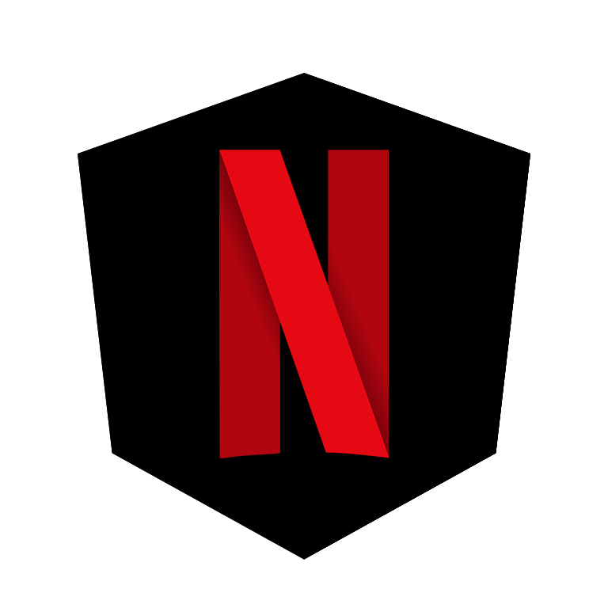

# Angular 16, RxJS and Bootstrap

<p align="center">
  
</p>

A case study of **Netflix Clone**, using Angular 16 framework, 
[RxJS](https://rxjs.dev/) library for manage state with Observable, 
[Nx](https://nx.dev/) for manage library and shared component in monorepo, 
Bootstrap for style (Scss), [Swipe.js](https://swiperjs.com/) for animation carousel, 
[Tv Maze API](https://www.tvmaze.com/api) and The [Movie DB API](https://developer.themoviedb.org/reference/intro/getting-started) for the data and [Youtube player](https://github.com/angular/components/blob/main/src/youtube-player/README.md), 
that wrap the embed Youtube player API.


## Demo Preview


<br />

## Live Preview
[Netflicks](https://netflicks-6c8b7.web.app)

## Table of Content
- [Angular 16, RxJS and Bootstrap](#angular-16-rxjs-and-bootstrap)
  - [Demo Preview](#demo-preview)
  - [Live Preview](#live-preview)
  - [Getting Started](#getting-started)
  - [Goals](#goals)
  - [Features](#features)
  - [Stack](#stack)


## Getting Started

```bash
git clone https://github.com/ac4mm/netflicks.git new-project
cd new-project
yarn install
yarn start
```

## Goals
Tha main goal of this simple repository is to learn how to use reactive programming (with RxJS) 
and Angular 16 with routing, lazy loading and the main feature of framework.

The project has evolved over time, starting from a situation in which I started to learn the framework and library, 
up to today, with all the best practices and evolutions of the monorepo, with the addition of the API for images and video trailers of Youtube.

## Features
- Lazy loading
- Fully responsive design
- Routing
- Used TV Maze API for fetching cover images


## Stack
Frontend
- [Angular](https://angular.io/)
- [RxJS](https://rxjs.dev/)
- [Bootstrap](https://getbootstrap.com/)
- [Swiper](https://swiperjs.com/)

API
- [Tv Maze API](https://www.tvmaze.com/api)
- [The movie DB (TMDB)](https://www.themoviedb.org/)

Hosting
- [Firebase](https://firebase.google.com/)

### Generate Components with Nx

Feature
```bash
nx generate @nrwl/angular:component fullscreen-intro-animation --project=netflicks --module=libs-feature --path=libs/feature/src/lib --export=true --style=scss

```

Shared
```bash
nx generate @nrwl/angular:component fullscreen-intro-animation --project=netflicks --module=shared --path=libs/shared/src/lib/components --export=true --style=scss    

```

### Generate Directive with Nx

```bash
nx generate @nrwl/angular:directive swiper-element --project=netflicks  --path=libs/shared/src/lib/directive

```

## Thinks to know
- I used the **combination of two API**, since some information was not present (e.g. trailer) in TvMaze API or logo, etc;
- I combined the cover images with the **logo**, since some images did not have the logo, so images with a double logo could be presented;
- for the **match** of the films/TV series I used a random value between 64 and 100, while for the **maturity rating**, I used a probability with a weight: 7+ Kids (10%), 13+ teenagers (20%), 16 + (40%), 18+ adults (60%);
- **Pages** Tv Shows, Movie, Latest and My List, Kids, Referral friends and **notification** aren't implemented;

## Support
by [@_ac4mm](https://twitter.com/_ac4mm)

<a href="https://www.buymeacoffee.com/ac4mm" target="_blank"></a>


